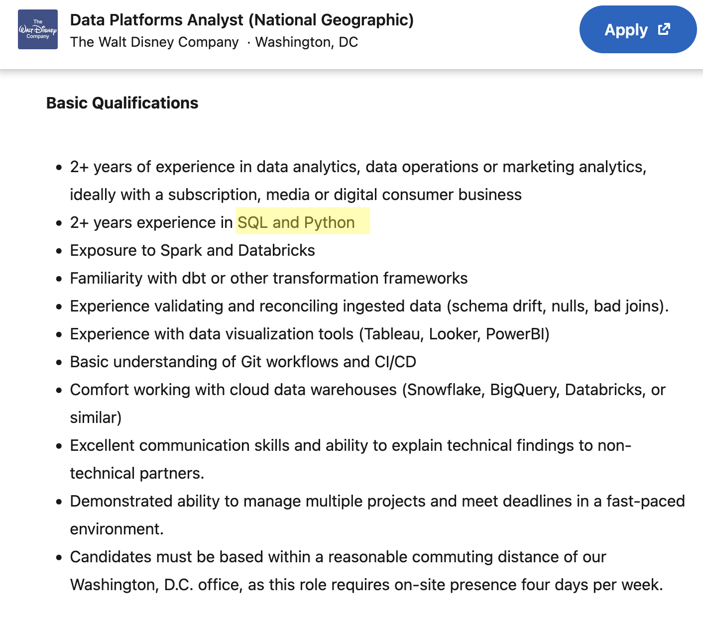
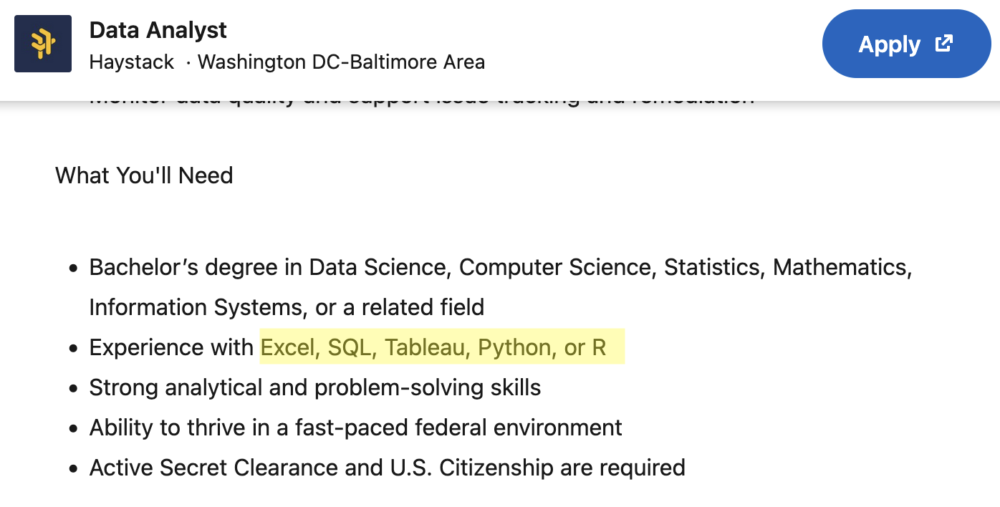
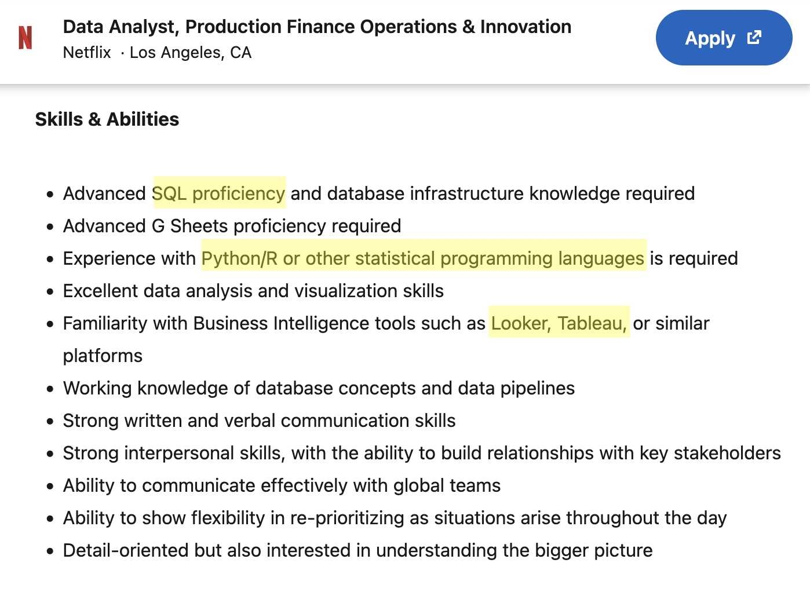

## Welcome {.center background-color="#ffffff"}

**Breaking the Syntax Barrier**

*Empowering Students to Code in Any Language*

::: {.small}
ECOTS 2026 · Breakout Session
:::

::: {.notes}
- Smile, wave, name + institution.
- Mention this will be interactive and encourage chat use throughout.
- Have co-host ready to monitor chat.
:::

---

## Quick poll {background-color="#ffffff"}

### What language do you (or your students) primarily use in class?

a. **R**
b. **Python**
c. **SQL**
d. **A mix, depending on the course**

::: {.notes}
- Pre-build this poll in Zoom web portal BEFORE the session.
- ~30 sec to launch + vote, ~20 sec to read results.
- Don't over-explain the result yet. We'll come back to
  "a mix" in a few slides.
:::

---

## Personal Experience {.center background-color="#ffffff"}

I learned statistics in **R**.

::: {.fragment}
Then a required CS course, **"Intro to AI"**, expected every
assignment in **Python**. I'd never written a line of it.
:::

::: {.fragment}
**It was intimidating.**
:::

::: {.fragment}
But once I got past the unfamiliar syntax, most of what I needed, like
data frames, indexing, fitting a model, and reading output,
**wasn't that different.**
:::

::: {.box .box-important .fragment}
[The big question]{.box-label}
**So why don't we let students dip their toes in earlier?**
:::

::: {.notes}
- This is a true personal story — tell it like one, not a slide of bullets.
- Beat 1: confidence in R after stats coursework.
- Beat 2: the syllabus said "submit a .py file" and the panic was real.
- Beat 3: let "intimidating" sit for a second, emotional core of the talk.
- Beat 4: "same ideas, new spelling", the realization.
- Beat 5: the closing question is the thesis of the whole talk. Let it land.
:::

---

## More than "the next class" {background-color="#ffffff"}

Making the next course less scary is reason enough. But there's more:

::: {.box .box-tip .fragment}
[Reason 1 · Easier to learn now]{.box-label}
**It's easier to learn now than later**: early exposure builds
familiarity, and familiarity makes the next language easier.
:::

::: {.box .box-highlight .fragment}
[Reason 2 · Industry expects it]{.box-label}
**Real jobs mix languages**: and teams collaborate across them every day.
:::

::: {.box .box-warning .fragment}
[Reason 3 · Languages come and go]{.box-label}
**MATLAB used to dominate engineering curricula; far less so now.**
Comfort *moving between* languages outlasts any single one of them.
:::

::: {.notes}
- Overview slide — three reasons, don't over-explain any one yet.
- #1 gets its own slide next (multilingual childhood).
- #2 gets concrete evidence in a couple of slides (the job postings).
- #3 (MATLAB) is mostly self-contained here — good moment for the room
  to nod along with their own "remember when everyone used X" example.
:::

---

## Like a multilingual childhood {.center background-color="#ffffff"}

Kids raised hearing two languages rarely speak both *perfectly*,
but a **third**, related language later comes much easier.

::: {.box .box-tip .fragment}
[Key idea]{.box-label}
**Early exposure doesn't need to produce fluency.**
It needs to produce *familiarity* so the next language
doesn't look foreign.
:::

::: {.notes}
- This is the emotional core of motivation #1 — give it room to breathe.
- Nobody expects a bilingual toddler to be "fluent" the way we'd judge an
  adult. But that early, low-stakes exposure rewires how easy the THIRD
  language is later.
- Same with R/Python/SQL in intro courses: a student doesn't need to master
  Python in week 3 of an R-based intro course. They just need it to stop
  looking like an alien alphabet.
:::

---

## Same job. Different syntax. {background-color="#ffffff"}

Three real **entry-level Data Analyst** postings.

::: {.job-row}
::: {}


**Disney** — SQL & Python
:::

::: {}


**Haystack** —SQL, Python, *or* R
:::

::: {}


**Netflix** — Python/R + SQL
:::
:::

::: {.box .box-highlight .fragment}
[Takeaway]{.box-label}
**Same role. Same skills. Different syntax listed as a "requirement."**
:::

::: {.notes}
- These are real postings, pulled while prepping this talk — not hypothetical.
- This is the evidence for motivation #2 (industry expects it).
- Point at the highlighted line in each: same "data analyst" role, different
  language combinations listed as requirements.
- Land the punchline: the underlying skill (query, summarize, model data) is
  identical across all three — only the syntax differs.
:::

---

## What's coming {background-color="#ffffff"}

For the rest of our time together:

::: {.fragment}
**A demo**: *a* way (not *the* way) to bring another language into your
course without installing a second IDE
:::

::: {.fragment}
**Prompt-building**: how to ask AI for a translation that teaches,
not just one that works
:::

::: {.fragment}
**Guardrails**: a few ways to keep students from just copy-pasting
:::

::: {.fragment}
**Parallels**: the same idea, side by side, in different languages
:::

::: {.fragment}
**Us, too**: how we use AI to build and maintain bilingual materials
:::

::: {.fragment}
**Then it's your turn**: an activity, and a chance to share your thoughts
:::

::: {.notes}
- This is the roadmap slide — keep it brisk, one breath per fragment.
- Each of these becomes its own beat during the demo; this just previews
  the shape of the next 15-20 minutes.
:::

---

## Meet Quarto {background-color="#ffffff"}

**Quarto** is a free, open authoring tool for writing and running code.

::: {.fragment}
Students can write **R** and **Python** (and some other languages!) in the *same document*.
:::

::: {.box .box-tip .fragment}
[The point]{.box-label}
**One environment, both languages.** Students see R and Python side by
side, instead of treating them as separate worlds.
:::


::: {.notes}
- Introduce Quarto as a student-facing tool, not a behind-the-scenes detail.
- Core message: one place to write and run both R and Python — lowers the
  barrier to seeing them as the same ideas in different syntax.
- The "we built the demo in it" line is just a side note — don't dwell.
- Keep it short; the demo makes it concrete.
:::

---

## Demo: R → Python with AI {background-color="#ffffff"}

A student has a regression working in R:

```r
model <- lm(score ~ hours, data = study_data)
summary(model)
```

They need it in Python. The obvious move is to ask an AI to translate.

::: {.box .box-important .fragment}
[The real question]{.box-label}
**Not *can* it translate, but what the student learns when it does.**
:::

::: {.notes}
- Frame for this room: everyone here can do this translation themselves.
  The point is what the *student* gets out of the exchange.
- Keep the R snippet up just long enough to anchor the next two slides.
:::

---

## The lazy prompt {background-color="#ffffff"}

::: {.columns}
::: {.column width="48%"}
**Prompt**

> "Translate this R code to Python."
:::
::: {.column width="52%"}
**What comes back**

```python
from sklearn.linear_model import LinearRegression

X = study_data[["hours"]]
y = study_data["score"]
LinearRegression().fit(X, y)
```

::: {.small}
Correct slope, correct intercept. runs first try.
:::
:::
:::

::: {.box .box-warning .fragment}
[The catch]{.box-label}
**It works, but what does it teach?** A correct answer feels like a
finished lesson. The student copies it, it runs, and they never understand the exact syntactic differences.
:::

::: {.notes}
- The result is genuinely fine — that's the trap. A working answer feels
  like a finished lesson.
- The gap is everything the student didn't have to think about.
:::

---

## A prompt that teaches {background-color="#ffffff"}

Same task, but ask for the *reasoning*, not just the code:

::: {.prompt-recipe}
> I know R. Translate this to Python with sklearn, and:
>
> - name the packages I need to import
> - map each R line to its Python equivalent
> - flag the idiom differences
> - end with one concept-check question
:::

::: {.box .box-tip .fragment}
[Reusable shape]{.box-label}
**goal · mapping · idiom · check**. The same moves work for any
language pair you teach.
:::


---

## What the prompt surfaced {background-color="#ffffff"}

It returned working Python and flagged what a simpler prompt would have
hidden from the student:

::: {.box .box-highlight .fragment}
[A hidden idiom]{.box-label}
That R's `score ~ hours` builds the design matrix on its own, while sklearn
has you hand it `X` and `y`.
:::

::: {.box .box-warning .fragment}
[A statistics gap]{.box-label}
That `LinearRegression` gives no SEs, t-stats, or p-values and pointed to
`statsmodels`' `ols()` for an R-style `summary()`.
:::


::: {.notes}
- This slide is evidence the prompt did its job — NOT a lesson on R vs Python
  for this room (they already know it).
- The point: the student gets these insights handed to them, with a built-in
  check that forces them to apply it.
- Don't dwell on the stats content; emphasize that the prompt *surfaced* it.
- Live, annotated walkthrough at kathusar.github.io/eCOTS26/lessons/Demo.html
  — drop in chat for later.
:::

---


## Activities to try in class {background-color="#ffffff"}

::: {.box .box-highlight .fragment}
[Matching]{.box-label}
Show an R snippet, pick the Python equivalent. A quick warm-up or exit ticket.
:::

::: {.box .box-tip .fragment}
[Fill-in-the-blank]{.box-label}
Give the working code in one language; blank key differences in the other.
:::

::: {.box .box-warning .fragment}
[Open Ended]{.box-label}
Explain the differences between two pieces of code they can see.
:::

::: {.notes}
- This is the "guardrails" beat — activity types that keep AI a bridge, not a crutch.
- It's a menu: pick whichever fits the class, you don't need all three.
- Matching and fill-in-the-blank are both live on the demo/activity pages —
  show them in the browser if there's time.
- Ties to the "classroom menu" line on the takeaways slide.
:::

---

## Quick recap {background-color="#ffffff"}

- Quarto as a way to run languages side by side
- A prompt template that teaches, not just translates
- A couple of checks so AI stays a bridge, not a crutch

::: {.box .box-important .fragment}
[Up next]{.box-label}
**Now it's your turn.**
:::

::: {.notes}
- Quick recap before handing off to the activity — don't re-teach, just
  name the four things that just happened.
- Transition: "let's put this into practice."
:::

---

## 🎯 Your turn {.center .section-break background-color="#ffffff"}

**Where could this live in *your* courses?**


::: {.notes}
- Section break — shift from "here's what we did" to "here's what YOU could do."
- This is the most interactive stretch; set the expectation that they'll talk.
:::

---

## In your groups {background-color="#ffffff"}

Take one course you actually teach:

::: {.box .box-tip}
[1 · Where it fits and where it would backfire]{.box-label}
Think about places a second language could appear succesfully and places it might break.
:::

::: {.box .box-highlight}
[2 · Make it concrete]{.box-label}
Talk through how you might keep students using AI for translating-to-understand, rather than blind copy and pasting.
:::

::: {.box .box-important}
[Share back]{.box-label}
We'll discuss and share back as a group!
:::

::: {.notes}
- Co-host: open breakout rooms (groups of 3-4), ~6-8 min, broadcast a 1-min warning.
- The "where would it backfire?" question is deliberate — it signals we trust
  the room to poke holes, not just cheerlead. Experienced teachers engage more
  with the failure mode than the happy path.
- Hybrid by design: the hands-on crowd builds a prompt for THEIR concept (not
  our regression, so it's not a demo repeat); everyone else just discusses.
- On return, read out 3-4 from the chat/shared slide — especially a good
  "backfire" — and react briefly.
- Take-home: the pandas/dplyr/SQL exercise still lives at
  kathusar.github.io/eCOTS26/lessons/Activity.html for anyone who wants a ready-made one.
:::

---

## Who benefits most? {background-color="#ffffff"}

- Students moving between courses that use different languages:
  *the everyday case*
- Students switching ecosystems mid-program (capstone, research lab)
- Students interviewing for internships and jobs

::: {.box .box-warning}
[Watch out]{.box-label}
**At risk of over-reliance:**

- Students who haven't built the underlying concept yet
- Students using AI to skip learning
:::

::: {.notes}
- Be honest: AI translation is most useful AFTER the concept is solid in one language.
- Don't introduce it as a first encounter with linear regression.
- "Everyday case" is the through-line — most students hit this every
  time they change courses, not just at graduation.
:::


---

## Take this with you {background-color="#ffffff"}

### Three things

1. **Prompt template insipration**: *goal · mapping · idiom · check*
2. **One concept** you can teach with translation
3. **One low-stakes activity** to make languge incorporation natural

::: {.box .box-tip .small}
[Take it home]{.box-label}
[**Repo:** https://github.com/KatHusar/eCOTS26](https://github.com/KatHusar/eCOTS26) —
prompt templates + R ↔ Python examples
:::

::: {.notes}
- Drop repo link in chat NOW (have it pre-copied).
- "If you remember one thing: early exposure builds comfort. Comfort builds
  the bridge to the next course — and eventually the next job."
- Thank co-host, attendees. Open for Q&A.
:::

---

## Q&A {.center background-color="#ffffff"}

### Questions?

::: {.small}
**Kat Husar** — kat.husar@duke.edu

**Marie Neubrander** — marie.neubrander@duke.edu

**Repo:** [https://github.com/KatHusar/eCOTS26](https://github.com/KatHusar/eCOTS26)
:::

::: {.notes}
- Most likely Q's:
  - "What AI tool do you use?" → answer honestly, mention free tiers
  - "How do you handle students who just copy-paste?" → scaffolded fading + concept checks
  - "Does this work for [language X]?" → yes, same prompt pattern
  - "What about academic integrity?" → frame as a *learning tool*, like a calculator; disclosure norms
:::
